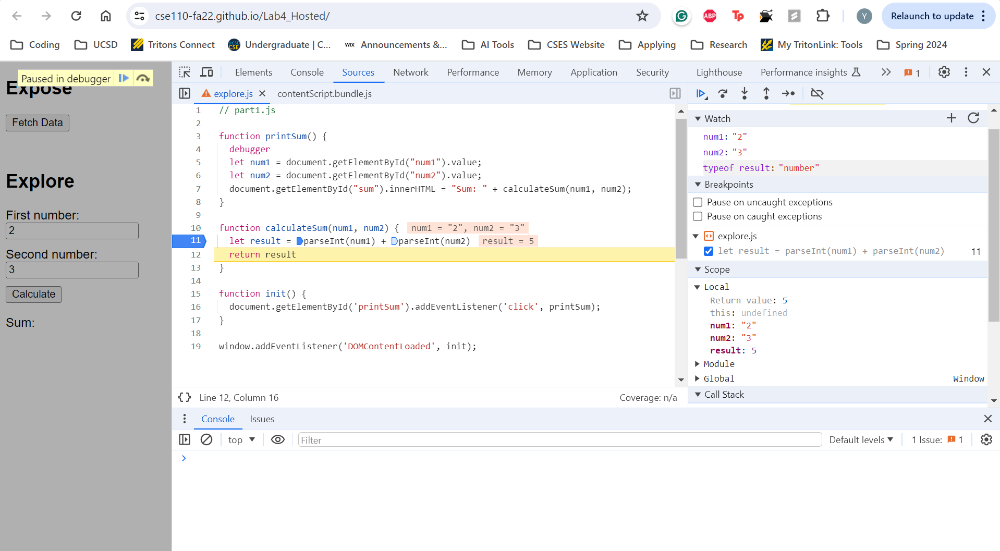

1. What was the bug?
   The bug was the both the inputs were in string format and so the line of code `let result = num1 + num2` resulted in a string concatenation. Hence, when I input 2 and 3 as my numbers, my output was 23. 
2. To fix this bug, I added a breakpoint at line 11 in the javascript file. I also added a few things to watch- these were `num1`, `num2` and `typeof result`. After determining the issue, I made sure to call the `parseInt` function on `num1` and `num2`. 
   
   Here is a screenshot of how I fixed it (this also displays the breakpoints and things that are being watched along with the correct answer):

   